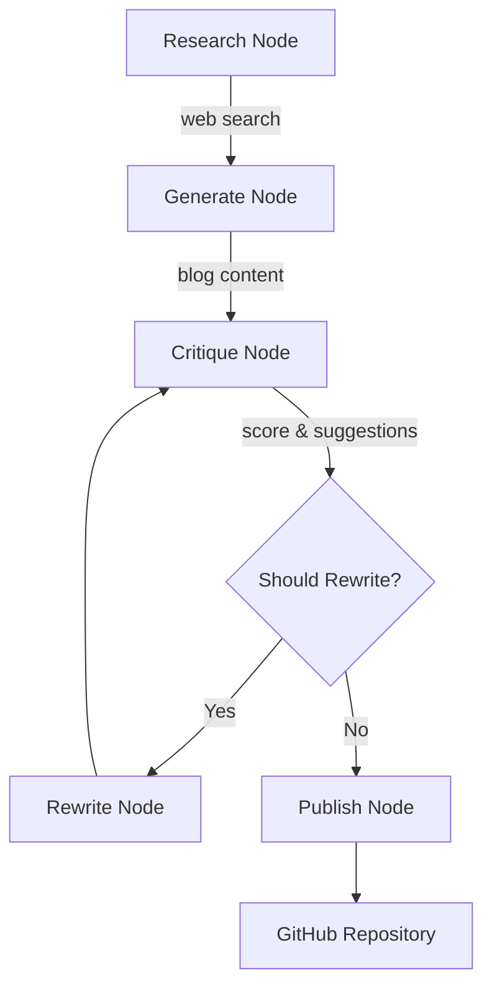

# AI Blog Generator Publisher - Code Explanation

This is an **autonomous blog publishing system** built with [LangGraph](https://langchain-ai.github.io/langgraph/) that researches topics, generates content, critiques it iteratively, and publishes to GitHub repositories.

## Architecture Overview



## Project Structure

| File | Purpose |
|------|---------|
| [`main.py`](main.py:1) | CLI entry point - parses arguments and runs workflow |
| [`src/ai_blog_publisher/graph.py`](src/ai_blog_publisher/graph.py:1) | LangGraph workflow builder - defines nodes and edges |
| [`src/ai_blog_publisher/state.py`](src/ai_blog_publisher/state.py:1) | TypedDict defining all workflow state fields |
| [`src/ai_blog_publisher/nodes.py`](src/ai_blog_publisher/nodes.py:1) | Individual workflow node implementations |
| [`src/ai_blog_publisher/config.py`](src/ai_blog_publisher/config.py:1) | Environment configuration management |
| [`src/ai_blog_publisher/tools/`](src/ai_blog_publisher/tools/) | LangChain tools for search, generation, critique, publishing |

## Workflow Process

1. **[`research_node()`](src/ai_blog_publisher/nodes.py:17)** - Uses SerpAPI to search the web for topic information
2. **[`generate_node()`](src/ai_blog_publisher/nodes.py:39)** - Creates initial blog post using LLM based on research
3. **[`critique_node()`](src/ai_blog_publisher/nodes.py:65)** - Scores content (1-100) and provides improvement suggestions
4. **[`should_rewrite_condition()`](src/ai_blog_publisher/nodes.py:152)** - Decides whether to loop back or continue:
   - Returns `True` if score < threshold AND loop_count < max_loops
   - Returns `False` to publish
5. **[`rewrite_node()`](src/ai_blog_publisher/nodes.py:88)** - Improves content based on critique suggestions
6. **[`publish_node()`](src/ai_blog_publisher/nodes.py:123)** - Pushes final Markdown to GitHub with YAML frontmatter

## Usage

```bash
python main.py --query "Python best practices"
python main.py --query "ML trends" --style "technical" --word_count 1200 --threshold 80 --max_loops 3
```

## Configuration Required (`.env`)

- `OPENAI_API_BASE` / `OPENAI_API_KEY` - LLM provider
- `SERPAPI_API_KEY` - Web search
- `GITHUB_TOKEN` / `GITHUB_REPO` - Repository for publishing
